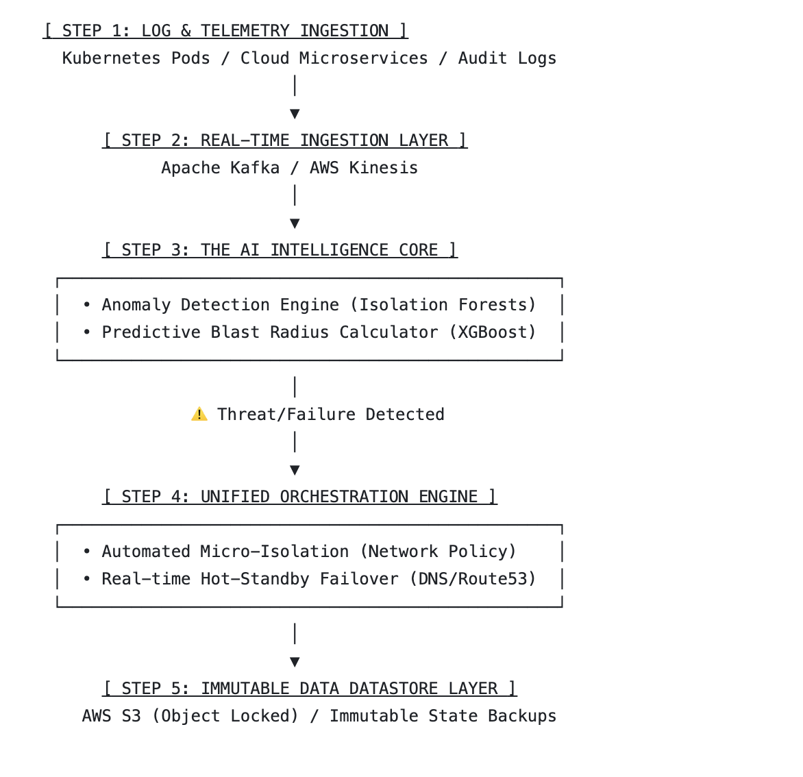

# AI-Driven Cloud-Native Security and Disaster Recovery Framework (AI-CNDR)

## Technical Architecture




AI-CNDR is a research-oriented prototype for integrating real-time cloud telemetry,
machine-learning-based anomaly detection, predictive impact assessment, automated
recovery orchestration, and immutable recovery-state storage.

The framework is designed to explore how AI-assisted decision support can improve
the speed, resilience, and consistency of cloud-native disaster recovery and
business continuity operations.


The framework follows a five-stage pipeline:

Telemetry Sources
↓
Real-Time Streaming
↓
AI Analysis
↓
Automated Recovery Orchestration
↓
Immutable Recovery Storage

---

## 1. Log and Telemetry Ingestion

### Purpose

Collects and normalizes operational and security telemetry from sources such as:

- Kubernetes pods
- Cloud-native microservices
- Application logs
- Security and audit logs
- Infrastructure metrics

Incoming information is converted into a common `TelemetryEvent` format so that
downstream services can process events consistently.

### Technology

- Java 21
- Spring Boot
- REST APIs
- Docker

---

## 2. Real-Time Ingestion Layer

### Purpose

Transports normalized telemetry from the ingestion layer to the AI intelligence
core using real-time event streaming.

### Supported Technologies

- Apache Kafka
- AWS Kinesis

Kafka is used as the primary prototype streaming mechanism, while AWS Kinesis
support represents the cloud-native streaming path.

### Event Flow

TelemetryEvent
↓
Apache Kafka / AWS Kinesis
↓
AI Intelligence Core

---

## 3. AI Intelligence Core

### Purpose

Analyzes incoming telemetry to identify anomalous behavior and estimate the
potential operational impact of detected incidents.

### Machine Learning Models

#### Isolation Forest

Used for anomaly detection in infrastructure telemetry.

The model evaluates patterns such as:

- CPU utilization
- Memory utilization
- Application latency
- Error rates
- Request volume
- Severity indicators

#### XGBoost

Used as the predictive blast-radius component.

The model is designed to estimate the potential scope and operational impact of
a detected anomaly so that the recovery engine can select an appropriate response.

### Example AI Decisions

- `MONITOR`
- `ISOLATE`
- `ISOLATE_AND_FAILOVER`

### Technology

- Python
- FastAPI
- Scikit-learn
- Isolation Forest
- XGBoost
- Docker

---

## 4. Unified Orchestration Engine

### Purpose

Receives AI analysis results and translates them into automated recovery actions.

### Supported Recovery Actions

#### Monitor

Continue observing an event when the predicted impact remains below the recovery
threshold.

#### Automated Micro-Isolation

Uses Kubernetes NetworkPolicy-based controls to isolate an affected workload and
reduce the potential blast radius of an incident.

#### Hot-Standby Failover

Supports automated failover logic designed to redirect service traffic to a
standby environment using DNS-based recovery mechanisms such as AWS Route53.

### Simulation Mode

The current prototype includes a simulation mode that allows orchestration logic
to be demonstrated without requiring a production Kubernetes cluster or live
Route53 infrastructure.

### Technology

- Java 21
- Spring Boot
- Kubernetes
- Fabric8 Kubernetes Client
- AWS Route53 SDK
- Docker

---

## 5. Immutable Datastore Layer

### Purpose

Preserves recovery-state information and backup artifacts in storage designed to
resist modification or deletion.

### AWS S3 Object Lock

The production-oriented design uses AWS S3 Object Lock to support Write Once,
Read Many (WORM) retention policies.

This approach can help protect recovery information from:

- Accidental deletion
- Unauthorized modification
- Ransomware-related encryption
- Recovery-state tampering

### Simulation Mode

The prototype can demonstrate immutable-storage workflows without requiring a
live AWS S3 Object Lock bucket.

### Technology

- Java 21
- Spring Boot
- AWS S3 SDK
- S3 Object Lock
- Docker

---

# End-to-End Processing Flow

A typical security event follows this sequence:

1. Kubernetes or cloud telemetry is collected.
2. Step 1 normalizes the event.
3. Step 2 publishes the event through Kafka or Kinesis.
4. Step 3 analyzes the event using machine-learning models.
5. The AI engine generates an anomaly assessment and predicted blast radius.
6. Step 4 determines the appropriate recovery action.
7. The affected workload can be monitored, isolated, or failed over.
8. Step 5 records the resulting recovery state in immutable storage.

Example:

CRITICAL telemetry
↓
Anomaly detected
↓
Blast radius estimated
↓
ISOLATE_AND_FAILOVER
↓
Kubernetes isolation
↓
Hot-standby failover
↓
Immutable recovery-state backup

---

# Repository Structure

```text
AI-Driven-Cloud-Native-Security-DR-Framework/
│
├── step1-log-telemetry-ingestion/
├── step2-realtime-ingestion/
├── step3-ai-intelligence-core/
├── step4-unified-orchestration-engine/
├── step5-immutable-datastore/
├── kubernetes/
├── docker/
├── config/
├── sample-data/
├── docs/
└── docker-compose.yml

Prototype Status

# AI-CNDR is currently an engineering and research prototype

Implemented components include:

Modular five-layer architecture
Telemetry normalization
Kafka event streaming
AWS Kinesis integration path
Isolation Forest anomaly-detection implementation
XGBoost predictive-impact implementation
AI-to-orchestration integration
Recovery decision logic
Kubernetes micro-isolation implementation
Route53 failover integration structure
Immutable recovery-state storage
AWS S3 Object Lock integration structure
Dockerized service architecture
Simulation mode for infrastructure-dependent recovery operations

# Design Goals

The framework is designed around four primary objectives:

Earlier threat awareness
Detect unusual infrastructure behavior before it develops into a larger
operational disruption.
Reduced recovery decision latency
Use AI-assisted analysis to support faster recovery decisions.
Reduced blast radius
Isolate compromised workloads before disruption spreads across dependent
services.
Resilient recovery-state preservation
Protect recovery information using immutable-storage mechanisms.

# Research and Practical Relevance

Cloud-based disaster recovery traditionally relies heavily on predefined recovery
procedures and human intervention.

AI-CNDR investigates a more adaptive approach in which real-time telemetry,
machine-learning analysis, automated orchestration, and immutable storage operate
as a coordinated resilience pipeline.

Potential application areas include organizations operating cloud-native systems
where service availability, cybersecurity, and rapid recovery are important,
including financial services, healthcare technology, government systems,
enterprise platforms, and other digitally dependent environments.

Current Limitations

This repository represents a research prototype rather than a production-ready
cybersecurity platform.

# Current limitations include:

Model training uses prototype datasets.
Production model validation requires larger operational datasets.
Kubernetes isolation requires a configured cluster for live execution.
Route53 recovery requires an AWS environment and hosted-zone configuration.
S3 Object Lock requires an appropriately configured AWS bucket.
Production security controls, authentication, IAM policies, and monitoring
require environment-specific implementation.

# Future Development

Planned enhancements include:

Larger telemetry datasets for AI model training
Model accuracy and performance evaluation
Prometheus monitoring
Grafana visualization
Kubernetes deployment manifests
Infrastructure-as-Code using Terraform
GitHub Actions CI/CD
IAM least-privilege policies
Automated integration testing
Multi-region recovery testing

# Technology Stack
Layer	                      Technologies
Telemetry                   Ingestion	Java, Spring Boot
Real-Time                   Streaming	Apache Kafka, AWS Kinesis
AI Intelligence	            Python, FastAPI, Isolation Forest, XGBoost
Recovery Orchestration	     Java, Spring Boot, Kubernetes, AWS Route53
Immutable Storage	          AWS S3, S3 Object Lock
Containerization	           Docker, Docker Compose

# Disclaimer

AI-CNDR is a research and engineering prototype intended to demonstrate an
architecture for AI-assisted cloud security and disaster recovery. Infrastructure
automation should be thoroughly tested and appropriately secured before use in
production environments.

